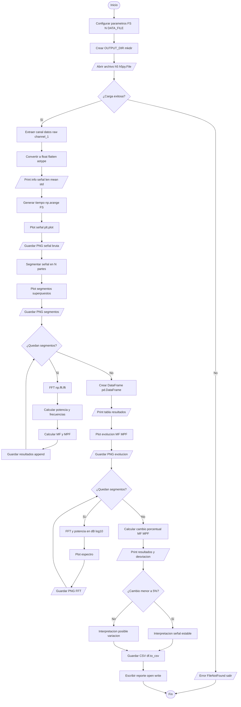
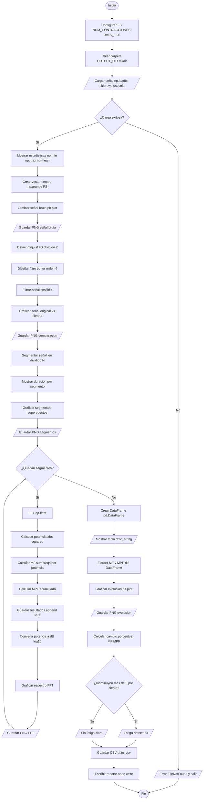
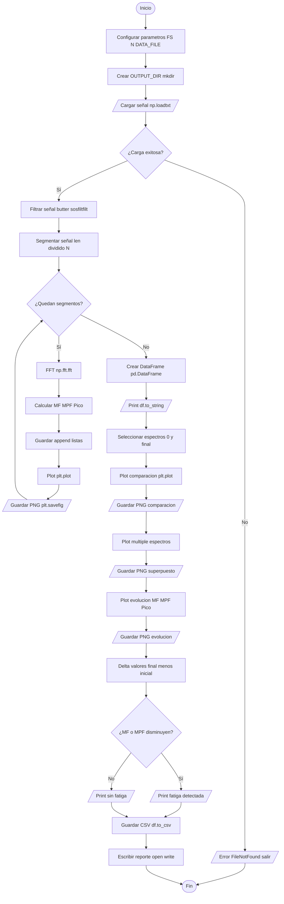

# Laboratorio-4
# Señales electromiográficas EMG 
# Objetivo.
Identificar y cuantificar los cambios en las características espectrales de una señal electromiográfica durante  la fatiga muscular mediante el procesamiento digital de señales.
## Obejtivos especificos.
Aplicar técnicas de filtrado digital para limpiar la señal EMG de ruidos y artefactos.
Implementar algoritmos para segmentar la señal en contracciones individuales y calcular la Frecuencia Media  y la Frecuencia Mediana.
Detectar la aparición de fatiga muscular mediante la observación del desplazamiento del espectro de potencia hacia las bajas frecuencias utilizando la Transformada Rápida de Fourier.
Comparar el comportamiento de una señal emulada (ideal) frente a una señal real capturada de un voluntario, analizando sus diferencias en el dominio de la frecuencia.
# Metodología del experimento.
El laboratorio se divide en tres fases:
## Fase A

En esta sección se trabaja con una señal EMG sintética generada artificialmente. Primero se carga la señal desde un archivo .h5 y se visualiza en el dominio del tiempo. Luego, la señal se segmenta en varias contracciones simuladas de igual duración.

Posteriormente, para cada segmento se calculan la frecuencia media (MF) y la frecuencia mediana (MPF) mediante la Transformada de Fourier, lo que permite analizar el contenido frecuencial de la señal. Finalmente, se grafican estos parámetros para observar su comportamiento a lo largo de las contracciones, sirviendo como referencia base sin presencia de fatiga muscular.

### Diagrama de flujo

## Análisis – Parte A (Señal EMG emulada)

A partir de la señal EMG sintética generada, se realizó un análisis tanto en el dominio del tiempo como en el dominio de la frecuencia con el objetivo de establecer una línea base de referencia sin presencia de fatiga muscular.

En la señal bruta se observa un comportamiento oscilatorio con amplitudes relativamente constantes a lo largo del tiempo, sin presencia evidente de ruido significativo ni artefactos externos. La señal presenta una distribución uniforme, característica de una señal emulada controlada.

Al segmentar la señal en cinco contracciones de igual duración, se evidencia que todas mantienen una estructura similar en términos de amplitud y variabilidad, lo cual confirma la estabilidad del generador de señal. No se observan cambios abruptos entre segmentos que sugieran alteraciones fisiológicas.

En el análisis espectral, se calcularon la Frecuencia Media (MF) y la Frecuencia Mediana (MPF) para cada contracción. Los resultados muestran una ligera tendencia decreciente en ambos parámetros:

- MF: 130.87 Hz → 122.86 Hz (−6.12%)
- MPF: 115.67 Hz → 108.67 Hz (−6.05%)

Aunque se observa una disminución progresiva, esta variación es relativamente pequeña y no corresponde a un proceso real de fatiga muscular. En señales EMG reales, la fatiga suele generar una caída más pronunciada y acompañada de cambios en la morfología de la señal.

La leve disminución observada puede atribuirse a variaciones internas del generador de señal o a efectos numéricos del procesamiento (segmentación y FFT), más que a un fenómeno fisiológico real.

En conjunto, los resultados confirman que la señal emulada presenta un comportamiento estable en el dominio espectral, por lo que es adecuada como referencia base para comparar con señales reales. Esta estabilidad permite validar que cualquier cambio significativo observado en las fases posteriores (Parte B y C) estará asociado a fenómenos fisiológicos como la fatiga muscular y no a artefactos del procesamiento.

---o.
## Fase B 

En esta parte se analiza una señal EMG real adquirida de un sujeto durante contracciones musculares repetidas. Inicialmente, la señal es cargada desde un archivo .txt y se aplica un filtro pasa banda (20–450 Hz) para eliminar ruido y artefactos.

Luego, la señal filtrada se divide en contracciones individuales, sobre las cuales se calculan la frecuencia media (MF) y la frecuencia mediana (MPF). Además, se obtiene y grafica la Transformada de Fourier para cada segmento.

Finalmente, se analiza la evolución de estos parámetros, permitiendo identificar posibles signos de fatiga muscular, evidenciados por un desplazamiento del contenido espectral hacia bajas frecuencias.

### Diagrama de flujo



Obtencion de la señal en el laboratorio.

Adquisición de EMG sobre el antebrazo realizando contracciones repetidas hasta el fallo muscular.
## Análisis – Parte B (Señal EMG real)

En la señal EMG real se observa inicialmente la presencia de ruido y componentes no deseados, los cuales son atenuados mediante la aplicación de un filtro pasa banda (20–450 Hz). La señal filtrada presenta una forma más limpia y centrada, conservando únicamente la actividad muscular relevante.

Tras la segmentación en cinco contracciones, se evidencia una variación progresiva en las características espectrales de la señal. A diferencia de la señal emulada, los segmentos muestran cambios más notorios en su comportamiento, reflejando la naturaleza fisiológica del músculo.

El análisis de la Frecuencia Media (MF) y la Frecuencia Mediana (MPF) muestra una tendencia decreciente:

- MF: 129.92 Hz → 122.30 Hz (−5.87%)
- MPF: 115.56 Hz → 108.67 Hz (−5.96%)

Esta disminución indica un desplazamiento del espectro de potencia hacia bajas frecuencias, lo cual es un indicador característico de fatiga muscular.

Desde el punto de vista fisiológico, este comportamiento se asocia con la disminución de la velocidad de conducción de las fibras musculares, la acumulación de metabolitos como el lactato y la reducción de ATP, lo que afecta la respuesta del músculo durante contracciones repetidas.

En conjunto, los resultados confirman la presencia de fatiga muscular en la señal analizada, validando el uso de parámetros espectrales como MF y MPF para su detección.

## Fase C 

En esta sección se profundiza en el análisis en frecuencia de la señal EMG real utilizando la Transformada Rápida de Fourier (FFT). Se calcula el espectro de amplitud para cada contracción, identificando parámetros clave como:

- Frecuencia media (MF)
- Frecuencia mediana (MPF)
- Frecuencia pico del espectro

Se comparan los espectros entre contracciones iniciales y finales, y se analizan de forma conjunta para observar la evolución del contenido frecuencial.

Este análisis permite evidenciar el fenómeno de fatiga muscular a través del desplazamiento del espectro hacia frecuencias más bajas, lo cual está asociado a cambios fisiológicos en el músculo durante el esfuerzo prolongado.

### Diagrama de flujo

Aplicación de la FFT para comparar los espectros de amplitud entre las primeras contracciones "músculo fresco" y las últimas "músculo fatigado".

## Análisis – Parte C (Análisis espectral mediante FFT)

**a. Aplicación de la FFT a cada contracción**

Se aplicó la Transformada Rápida de Fourier (FFT) a cada una de las contracciones segmentadas de la señal EMG real, permitiendo transformar la señal del dominio del tiempo al dominio de la frecuencia. Esto facilitó el análisis del contenido espectral asociado a la actividad muscular en diferentes etapas del esfuerzo.

---

**b. Espectro de amplitud (frecuencia vs. magnitud)**

A partir de la FFT, se obtuvieron los espectros de amplitud para cada contracción. Estos espectros muestran cómo se distribuye la energía de la señal en función de la frecuencia, permitiendo identificar las bandas dominantes y su evolución a lo largo del tiempo. Se observa que la energía se concentra principalmente en un rango intermedio de frecuencias, característico de señales EMG.

---

**c. Comparación entre contracciones iniciales y finales**

Al comparar los espectros de las primeras contracciones con los de las últimas, se evidencia un cambio progresivo en la distribución espectral. Las contracciones iniciales presentan mayor contenido en frecuencias medias-altas, mientras que en las contracciones finales se observa una redistribución de la energía hacia frecuencias más bajas.

---

**d. Reducción del contenido de alta frecuencia**

Se identifica una disminución del contenido de alta frecuencia a medida que avanza el número de contracciones. Este fenómeno es consistente con el comportamiento esperado durante la fatiga muscular, donde la actividad eléctrica del músculo pierde componentes rápidos debido a la disminución en la velocidad de conducción de las fibras musculares.

---

**e. Desplazamiento del pico espectral**

El análisis muestra un desplazamiento del pico espectral desde aproximadamente 82.6 Hz en la primera contracción hasta 66.6 Hz en la última, lo que representa una reducción de 16 Hz. De manera similar, la Frecuencia Media (MF) y la Frecuencia Mediana (MPF) también presentan disminuciones de 7.6 Hz y 6.9 Hz respectivamente.

Este desplazamiento hacia frecuencias más bajas está directamente relacionado con el esfuerzo sostenido, ya que refleja cambios fisiológicos como la acumulación de metabolitos (lactato, iones H⁺) y la reducción de ATP, los cuales afectan la respuesta eléctrica del músculo.

---

**f. Conclusiones del análisis espectral**

El análisis espectral mediante FFT demuestra ser una herramienta eficaz para la evaluación de la fatiga muscular en señales electromiográficas. La disminución de parámetros como MF, MPF y la frecuencia pico, junto con el desplazamiento del espectro hacia bajas frecuencias, constituyen indicadores confiables del estado del músculo.

Estos resultados evidencian que el procesamiento en el dominio de la frecuencia permite detectar cambios fisiológicos que no son fácilmente observables en el dominio del tiempo, lo que lo convierte en una técnica clave para aplicaciones en diagnóstico, monitoreo y rehabilitación muscular.

---

# Marco conceptual
##Fisiología.
La fatiga muscular se define como la disminución de la capacidad del músculo para generar fuerza o mantener una contracción eficaz. 
Durante el ejercicio intenso, se acumula lactato y disminuye el adenosín trifosfato (ATP).
El aumento de iones de hidrógeno reduce la velocidad de conducción de los potenciales de acción en las fibras musculares.
Para compensar la pérdida de fuerza, el sistema nervioso busca o une más unidades motoras, lo que inicialmente aumenta la amplitud de la señal 
## Electromiografía de Superficie 
Es una técnica no invasiva que registra la actividad eléctrica de los músculos desde la piel. 
La señal capturada es la suma de los potenciales de acción de las unidades motoras que ocurren durante la contracción.
## Procesamiento Espectral y Transformada de Fourier
Dado que la señal EMG en el tiempo parece ruido aleatorio, es necesario llevarla al dominio de la frecuencia mediante la Transformada Rápida de Fourier (FFT).
Frecuencia Media (MNF): Es el promedio estadístico del espectro de potencia de la señal.
Frecuencia Mediana (MDF): Es la frecuencia que divide el espectro de potencia en dos regiones con la misma cantidad de energía.
## Indicadores de Fatiga 
En el espectro medida que el músculo se fatiga, ocurre un desplazamiento del espectro hacia las bajas frecuencias. 
Esto se debe a la disminución de la velocidad de conducción.
Las fibras musculares se vuelven más lentas al transmitir impulsos eléctricos.
##Filtrado Digital
Para obtener una señal útil, se debe aplicar un filtro pasa banda con un rango de 20 a 450 Hz.
Punto de corte inferior (20 Hz) eliminando artefactos de movimiento y ruido de la línea base.
Punto de corte superior (450 Hz) eliminando ruido electrónico de alta frecuencia, conservando la energía útil de la señal muscular.
# Procedimiento
#PARTE A - 
Captura de la Señal EmuladaEsta fase busca establecer un punto de comparación con una señal ideal que no presenta fatiga real.
Ajustar el generador de señales biológicas en modo EMG para simular cinco contracciones musculares voluntarias.
Capturar y almacenar los datos para el procesamiento digital.
Dividir la señal continua en las cinco contracciones individuales simuladas.
Determinar la Frecuencia Media (MNF).
Determinar la Frecuencia Mediana (MDF).
Tabular los resultados y graficar la evolución de las frecuencias para verificar su estabilidad.
#PARTE B 
Captura de la Señal de PacienteAquí es donde observarás el fenómeno fisiológico real de la fatiga.
Colocar electrodos de superficie sobre un grupo muscular en el antebrazo asegurando que la piel esté limpia y seca para reducir el ruido
Registrar la señal mientras el voluntario realiza contracciones repetidas hasta alcanzar la fatiga total o falla 
Aplicar un filtro pasa banda de 20-450 Hz para eliminar el ruido de la red eléctrica y artefactos de movimiento.
Dividir la señal total en el número exacto de contracciones realizadas.
Calcular la frecuencia media y mediana para cada una de estas contracciones
Graficar la evolución de MNF y MDF y discutir cómo se relacionan con la fisiología del músculo fatigado.
PARTE C 
Análisis Espectral mediante FFTEn esta fase utilizarás herramientas matemáticas avanzadas para visualizar el cambio de energía en la señal.
Aplicar la FFT a cada una de las contracciones segmentadas de la señal real.
Graficar el espectro de amplitud (Frecuencia vs. Magnitud).
Comparar visualmente los espectros de las primeras contracciones frente a las últimas.
Calcular el desplazamiento del pico espectral hacia la izquierda (bajas frecuencias) debido al esfuerzo sostenido.
# Conclusiones
Se demostró que la aplicación de un filtro pasa banda (20-450 Hz) es indispensable para el procesamiento de señales EMG reales. Este proceso eliminó con éxito 
el ruido de baja frecuencia (artefactos de movimiento) y el ruido de alta frecuencia, permitiendo que el análisis espectral posterior se basara únicamente en la 
actividad electrofisiológica del músculo.
La Frecuencia Media (MNF) y la Frecuencia Mediana (MDF) resultaron ser indicadores robustos para la detección de la fatiga muscular. 
Se observó una tendencia decreciente constante en ambos parámetros a medida que aumentaba el número de contracciones, validando su uso como métricas objetivas para monitorear el agotamiento muscular.
Mediante el uso de la Transformada Rápida de Fourier (FFT), se evidenció visualmente el desplazamiento del espectro de potencia hacia las bajas frecuencias durante la progresión de la fatiga. 
Este cambio se atribuye fisiológicamente a la reducción de la velocidad de conducción de los potenciales de acción y a la sincronización de las unidades motoras debido a la acumulación de metabolitos como el lactato.

La comparación entre la señal emulada (Parte A) y la señal de paciente (Parte B) permitió distinguir entre un comportamiento idealizado y un proceso fisiológico dinámico. 
Mientras que la señal emulada mantuvo valores de frecuencia estables, la señal real mostró la variabilidad natural y el decaimiento esperado, lo que confirma la calidad de la adquisición y el montaje experimental realizado.
Se concluye que, aunque las técnicas espectrales son altamente precisas, su implementación en escenarios no controlados (como entrenamientos de atletas de alto rendimiento) presenta desafíos técnicos significativos. Factores como el ruido ambiental, la sudoración (que altera la impedancia de los electrodos) y los movimientos bruscos requieren algoritmos de filtrado más avanzados y sensores inalámbricos para garantizar la fiabilidad del diagnóstico de fatiga en tiempo real.
# Preguntas para la Discusión
## 1. ¿Cambian los valores de frecuencia media y mediana a medida que el músculo se acerca a la fatiga?
Sí. Se observa una disminución progresiva en ambos valores. Mientras que en una señal ideal estos valores permanecen casi constantes tras la estabilización inicial, en una señal real de paciente, la pendiente de caída de la frecuencia media es un indicador directo del ritmo de fatiga del grupo muscular evaluado.
## 2. ¿A qué podría atribuirse este cambio?
Se atribuye a dos factores principales:
La ralentización de los potenciales de acción por fatiga metabólica. 
La sincronización de las unidades motoras. Cuando el músculo se agota, las unidades motoras tienden a disparar de forma más rítmica y conjunta para intentar sostener la fuerza, lo que aumenta la energía en las frecuencias bajas del espectro.
## 3. ¿Cómo justifica el uso de la Transformada de Fourier en terapias de rehabilitación?
El uso de la FFT es fundamental porque permite cuantificar la recuperación muscular de manera objetiva. En rehabilitación, no basta con saber si el paciente siente fuerza el análisis espectral permite al clínico observar si el espectro de la señal está volviendo a rangos de frecuencia normales (altos), lo que indica que las fibras musculares rápidas están recuperando su funcionalidad y velocidad de conducción.
# Declaración de uso de herramientas de IA

Durante la elaboración de este laboratorio se utilizaron herramientas de inteligencia artificial basadas en modelos de lenguaje como apoyo en tareas de consulta, revisión de redacción y organización del código.

Estas herramientas se emplearon únicamente como asistencia técnica para estructuración del documento, aclaración de conceptos y verificación de implementaciones en Python.

Los diagramas de flujo fueron generados inicialmente mediante herramientas compatibles con Mermaid , y posteriormente ajustados para representar la lógica del programa.
# Cómo ejecutar el proyecto
Para ejecutar este laboratorio es necesario tener todos los archivos en una misma carpeta y contar con Python previamente instalado en el sistema.

> ⚠️ Todos los archivos deben estar en la misma carpeta para evitar errores de lectura de datos.

### 1. Estructura del proyecto

Asegúrate de que todos los archivos se encuentren en el mismo directorio:

``` id="treefix"
/Carpeta_designada
│
├── Parte A.py
├── Parte B.py
├── Parte C.py
├── opensiseñalda.h5
├── opensiseñalda.txt
└── (carpetas de resultados se generan automáticamente)
### 2. Instalación de dependencias

Los scripts utilizan las siguientes librerías de Python:

- numpy  
- matplotlib  
- pandas  
- scipy  
- h5py  

Instálalas ejecutando el siguiente comando en la terminal:

```bash
pip install numpy matplotlib pandas scipy h5py
```
### 3. Ejecución de los scripts
Cada parte del laboratorio se ejecuta de forma independiente:

```bash
python "Parte A.py"
python "Parte B.py"
python "Parte C.py"
```
### 4. Resultados generados
Al ejecutar cada script, se crearán automáticamente carpetas con los resultados:
- `resultados_parte_a/`
- `resultados_parte_b/`
- `resultados_parte_c/`
En estas carpetas encontrarás:

Gráficas en formato .png
Tablas de resultados en .csv
Reportes en .txt

### 3. Notas importantes

- Los nombres de los archivos de señal (`opensiseñalda.h5` y `opensiseñalda.txt`) están definidos directamente en los scripts.  
  Sin embargo, estos pueden modificarse fácilmente editando la variable `DATA_FILE` en cada archivo `.py` en caso de que se desee trabajar con otros datos.

- El proyecto está diseñado para trabajar con:
  - Archivos `.h5` → para la señal EMG emulada (Parte A)  
  - Archivos `.txt` → para la señal EMG real (Partes B y C)  

  Usar otros formatos requeriría modificar la forma en que se cargan los datos en el código.

- Si ocurre un error de archivo no encontrado, verifica que todos los archivos estén en la misma carpeta o que la ruta especificada en `DATA_FILE` sea correcta.

- Los scripts están configurados con una frecuencia de muestreo de **1000 Hz**, la cual también puede ajustarse directamente en el código si se utilizan señales con diferentes características.

---
