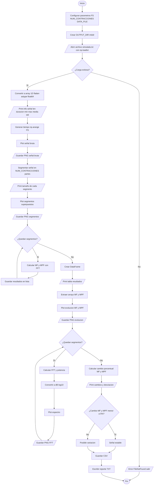
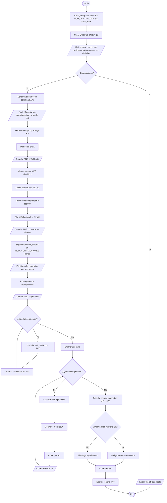
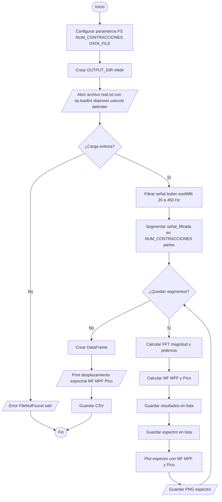

# Laboratorio-4
# Señales electromiográficas EMG 
# Objetivo.
Identificar y cuantificar los cambios en las características espectrales de una señal electromiográfica durante  la fatiga muscular mediante el procesamiento digital de señales.
## Obejtivos especificos.
Aplicar técnicas de filtrado digital para limpiar la señal EMG de ruidos y artefactos.
Implementar algoritmos para segmentar la señal en contracciones individuales y calcular la Frecuencia Media  y la Frecuencia Mediana.
Detectar la aparición de fatiga muscular mediante la observación del desplazamiento del espectro de potencia hacia las bajas frecuencias utilizando la Transformada Rápida de Fourier.
Comparar el comportamiento de una señal emulada (ideal) frente a una señal real capturada de un voluntario, analizando sus diferencias en el dominio de la frecuencia.
# Metodología del experimento.
El laboratorio se divide en tres fases:
## Parte A

En esta sección se trabaja con una señal EMG sintética generada artificialmente. Primero se carga la señal desde un archivo .txt y se visualiza en el dominio del tiempo. Luego, la señal se segmenta en varias contracciones simuladas de igual duración.

Posteriormente, para cada segmento se calculan la frecuencia media (MF) y la frecuencia mediana (MPF) mediante la Transformada de Fourier, lo que permite analizar el contenido frecuencial de la señal a lo largo de las contracciones.
### Diagrama de flujo

## resultados 


- Frecuencia de muestreo (FS): 1000 Hz  
- Duración: 20.00 s  
- Número de contracciones: 5  

| Contracción | MF (Hz)  | MPF (Hz) |
|------------|---------|----------|
| 1          | 1.3262  | 0.25     |
| 2          | 1.3262  | 0.25     |
| 3          | 1.0644  | 0.25     |
| 4          | 13.9032 | 7.50     |
| 5          | 14.0410 | 7.50     |


- **MF:** 1.33 → 14.04 Hz (**+958.76%**)  
- **MPF:** 0.25 → 7.50 Hz (**+2900.00%**)
- 
## Análisis – Parte A (Señal EMG emulada)

En la señal emulada se observa que las tres primeras contracciones presentan valores de frecuencia media (MF) muy bajos y prácticamente constantes (~1.06–1.33 Hz), así como una frecuencia mediana (MPF) fija en 0.25 Hz. Sin embargo, a partir de la cuarta contracción ocurre un incremento abrupto en ambas métricas, alcanzando valores cercanos a 14 Hz en MF y 7.5 Hz en MPF.

El aumento del 958.76% en MF y 2900% en MPF indica un cambio abrupto en el contenido frecuencial, lo cual no corresponde a un fenómeno de fatiga muscular.  En cambio, sugiere una modificación en la señal generada, como un cambio en la frecuencia base o en los parámetros del generador entre segmentos.

En conclusión, la señal emulada no representa adecuadamente el comportamiento fisiológico de la fatiga, sino que funciona como una referencia artificial en la que se evidencian inconsistencias en la generación de las contracciones.

## Parte B 

En esta parte se analiza una señal EMG real adquirida de un sujeto durante contracciones musculares repetidas. Inicialmente, la señal es cargada desde un archivo .txt y se aplica un filtro pasa banda (20–450 Hz) para eliminar ruido y artefactos.

Posteriormente, la señal filtrada se segmenta en contracciones individuales, sobre las cuales se calculan la frecuencia media (MF) y la frecuencia mediana (MPF, usada aquí como estimación de la frecuencia mediana). Además, se obtiene y grafica la Transformada de Fourier para cada segmento.

Finalmente, se analiza la evolución de estos parámetros, permitiendo identificar signos de fatiga muscular a partir del desplazamiento del contenido espectral hacia bajas frecuencias.
### Diagrama de flujo



Obtencion de la señal en el laboratorio.

Adquisición de EMG sobre el antebrazo realizando contracciones repetidas hasta el fallo muscular.
##Resultados


PARTE B - ANÁLISIS DE SEÑAL REAL

| Contracción | MF (Hz)   | MPF (Hz)  |
|------------|----------|-----------|
| 1          | 129.9207 | 115.5690  |
| 2          | 125.3367 | 111.8531  |
| 3          | 123.9684 | 109.6451  |
| 4          | 121.9557 | 107.3833  |
| 5          | 122.3006 | 108.6523  |


MF cambio: -5.87%
MPF cambio: -5.98%

## Análisis – Parte B (Señal EMG real)
En la señal real se observa una tendencia general decreciente tanto de la frecuencia media (MF) como de la frecuencia mediana (MPF) a lo largo de las contracciones:

MF: 129.9 → 122.3 Hz (−5.87%)
MPF: 115.6 → 108.7 Hz (−5.98%)

Según la guía, se debe analizar la tendencia de estas frecuencias y relacionarla con la fatiga muscular. La reducción observada es consistente en términos generales, lo que indica un desplazamiento del contenido espectral hacia frecuencias más bajas.

Desde el punto de vista fisiológico, este comportamiento se explica porque, durante la fatiga muscular:

Disminuye la velocidad de conducción de las fibras musculares
Se acumulan metabolitos como lactato y iones H⁺
Se reduce la eficiencia en la generación de potenciales de acción

Esto provoca una reducción de los componentes de alta frecuencia en la señal EMG y una mayor concentración de energía en frecuencias bajas.

Por lo tanto, la tendencia descendente en MF y MPF confirma la presencia de fatiga muscular, cumpliendo con lo esperado teóricamente y validando el uso de estas métricas como indicadores confiables de fatiga muscular.

## Parte C 

En esta sección se profundiza en el análisis en frecuencia de la señal EMG real utilizando la Transformada Rápida de Fourier (FFT). Se calcula el espectro de amplitud para cada contracción, identificando parámetros clave como:

Frecuencia media (MF)
Frecuencia mediana (MPF, usada aquí como estimación de la frecuencia mediana)
Frecuencia pico del espectro

Se comparan los espectros entre contracciones iniciales y finales para observar la evolución del contenido frecuencial.

Este análisis permite evidenciar el fenómeno de fatiga muscular a través del desplazamiento del espectro hacia frecuencias más bajas, lo cual está asociado a cambios fisiológicos en el músculo durante el esfuerzo prolongado.
### Diagrama de flujo

Aplicación de la FFT para comparar los espectros de amplitud entre las primeras contracciones "músculo fresco" y las últimas "músculo fatigado".

##Resultados


**Parámetros:**
- Frecuencia de muestreo (FS): 1000 Hz  
- Número de contracciones: 5  
- Filtro: Pasa banda 20–450 Hz (Butterworth orden 4)  


| Contracción | MF (Hz)   | MPF (Hz)  | Pico (Hz) |
|------------|----------|-----------|-----------|
| 1          | 129.9207 | 115.5690  | 82.6108   |
| 2          | 125.3367 | 111.8531  | 75.1252   |
| 3          | 123.9684 | 109.6451  | 76.9562   |
| 4          | 121.9557 | 107.3833  | 100.2747  |
| 5          | 122.3006 | 108.6523  | 89.4309   |


## Análisis – Parte C 

El análisis espectral permite observar con mayor detalle cómo cambia el contenido en frecuencia de la señal. Según la guía, se debe comparar espectros, identificar pérdida de altas frecuencias y analizar el desplazamiento del pico espectral.

En los resultados se evidencia:

Pico espectral: 82.6 → 89.4 Hz (+6.8 Hz)
MF: 129.9 → 122.3 Hz (−7.6 Hz)
MPF: 115.6 → 108.7 Hz (−6.9 Hz)

La disminución de MF y MPF evidencia un corrimiento espectral hacia frecuencias más bajas, característico de la fatiga muscular. Sin embargo, el comportamiento del pico espectral no sigue una tendencia monótona, por lo que resulta menos robusto como indicador en este caso.

Además:

El pico espectral presenta variaciones entre contracciones, sin una tendencia clara, lo que sugiere que no es un indicador consistente del proceso de fatiga en esta señal.
La disminución de MF y MPF refuerza que la energía de la señal se redistribuye hacia bajas frecuencias
La comparación entre la primera y última contracción evidencia una señal más “lenta” en términos espectrales

Fisiológicamente, esto se relaciona con:

Menor reclutamiento de fibras rápidas (tipo II)
Disminución de la sincronización neuromuscular
Reducción de la velocidad de conducción

En conclusión, el análisis FFT permite visualizar y cuantificar el fenómeno de fatiga de forma más clara, mostrando una reducción del contenido de alta frecuencia a medida que avanza el esfuerzo, lo cual valida el uso del análisis espectral como herramienta diagnóstica en EMG.

---

# Marco conceptual

## Fisiología.

La fatiga muscular se define como la disminución de la capacidad del músculo para generar fuerza o mantener una contracción eficaz. 
Durante el ejercicio intenso, se acumula lactato y disminuye el adenosín trifosfato (ATP).
El aumento de iones de hidrógeno reduce la velocidad de conducción de los potenciales de acción en las fibras musculares.
Para compensar la pérdida de fuerza, el sistema nervioso busca o une más unidades motoras, lo que inicialmente aumenta la amplitud de la señal 

## Electromiografía de Superficie 

Es una técnica no invasiva que registra la actividad eléctrica de los músculos desde la piel. 
La señal capturada es la suma de los potenciales de acción de las unidades motoras que ocurren durante la contracción.
## Procesamiento Espectral y Transformada de Fourier
Dado que la señal EMG en el tiempo parece ruido aleatorio, es necesario llevarla al dominio de la frecuencia mediante la Transformada Rápida de Fourier (FFT).
Frecuencia Media (MNF): Es el promedio estadístico del espectro de potencia de la señal.
Frecuencia Mediana (MDF): Es la frecuencia que divide el espectro de potencia en dos regiones con la misma cantidad de energía.

## Indicadores de Fatiga 

En el espectro medida que el músculo se fatiga, ocurre un desplazamiento del espectro hacia las bajas frecuencias. 
Esto se debe a la disminución de la velocidad de conducción.
Las fibras musculares se vuelven más lentas al transmitir impulsos eléctricos.

##Filtrado Digital

Para obtener una señal útil, se debe aplicar un filtro pasa banda con un rango de 20 a 450 Hz.
Punto de corte inferior (20 Hz) eliminando artefactos de movimiento y ruido de la línea base.
Punto de corte superior (450 Hz) eliminando ruido electrónico de alta frecuencia, conservando la energía útil de la señal muscular.

# Procedimiento

## PARTE A 

Captura de la Señal EmuladaEsta fase busca establecer un punto de comparación con una señal ideal que no presenta fatiga real.
Ajustar el generador de señales biológicas en modo EMG para simular cinco contracciones musculares voluntarias.
Capturar y almacenar los datos para el procesamiento digital.
Dividir la señal continua en las cinco contracciones individuales simuladas.
Determinar la Frecuencia Media (MNF).
Determinar la Frecuencia Mediana (MDF).
Tabular los resultados y graficar la evolución de las frecuencias para verificar su estabilidad.

## PARTE B 

Captura de la Señal de PacienteAquí es donde observarás el fenómeno fisiológico real de la fatiga.
Colocar electrodos de superficie sobre un grupo muscular en el antebrazo asegurando que la piel esté limpia y seca para reducir el ruido
Registrar la señal mientras el voluntario realiza contracciones repetidas hasta alcanzar la fatiga total o falla 
Aplicar un filtro pasa banda de 20-450 Hz para eliminar el ruido de la red eléctrica y artefactos de movimiento.
Dividir la señal total en el número exacto de contracciones realizadas.
Calcular la frecuencia media y mediana para cada una de estas contracciones
Graficar la evolución de MNF y MDF y discutir cómo se relacionan con la fisiología del músculo fatigado.

## PARTE C 

Análisis Espectral mediante FFTEn esta fase utilizarás herramientas matemáticas avanzadas para visualizar el cambio de energía en la señal.
Aplicar la FFT a cada una de las contracciones segmentadas de la señal real.
Graficar el espectro de amplitud (Frecuencia vs. Magnitud).
Comparar visualmente los espectros de las primeras contracciones frente a las últimas.
Calcular el desplazamiento del pico espectral hacia la izquierda (bajas frecuencias) debido al esfuerzo sostenido.

# Conclusiones

Se demostró que la aplicación de un filtro pasa banda (20–450 Hz) es indispensable para el procesamiento de señales EMG reales. Este proceso eliminó con éxito el ruido de baja frecuencia (artefactos de movimiento) y el ruido de alta frecuencia, permitiendo que el análisis espectral posterior se basara principalmente en la actividad electrofisiológica del músculo.

La Frecuencia Media (MF) y la Frecuencia Mediana (MPF, usada como estimación de la frecuencia mediana) resultaron ser indicadores robustos para la detección de la fatiga muscular. Se observó una tendencia general decreciente en ambos parámetros a medida que aumentaba el número de contracciones (MF: 129.9 → 122.3 Hz; MPF: 115.6 → 108.7 Hz), validando su uso como métricas objetivas para monitorear el agotamiento muscular.

Mediante el uso de la Transformada Rápida de Fourier (FFT), se evidenció el desplazamiento del espectro de potencia hacia las bajas frecuencias durante la progresión de la fatiga. Este cambio se atribuye fisiológicamente a la reducción de la velocidad de conducción de los potenciales de acción y a la acumulación de metabolitos, lo que afecta la dinámica de activación de las unidades motoras.

La comparación entre la señal emulada (Parte A) y la señal real (Parte B) permitió distinguir entre un comportamiento artificial y un proceso fisiológico dinámico. Mientras que la señal emulada presentó cambios abruptos e inconsistentes en el contenido frecuencial, la señal real mostró la tendencia esperada asociada a la fatiga muscular, lo que respalda la validez del procedimiento experimental.

Se concluye que, aunque las técnicas espectrales son altamente precisas, su implementación en escenarios no controlados (como entrenamientos de alto rendimiento) presenta desafíos técnicos significativos. Factores como el ruido ambiental, la sudoración (que altera la impedancia de los electrodos) y los movimientos bruscos requieren estrategias de filtrado más robustas y sistemas de adquisición adecuados para garantizar la fiabilidad del análisis de fatiga en tiempo real.

# Preguntas para la Discusión

## 1. ¿Cambian los valores de frecuencia media y mediana a medida que el músculo se acerca a la fatiga?

Sí. Se observa una disminución progresiva en ambos valores. Mientras que en una señal ideal estos valores permanecen casi constantes tras la estabilización inicial, en una señal real de paciente, la pendiente de caída de la frecuencia media es un indicador directo del ritmo de fatiga del grupo muscular evaluado.

## 2. ¿A qué podría atribuirse este cambio?

Se atribuye a dos factores principales:
La ralentización de los potenciales de acción por fatiga metabólica. 
La sincronización de las unidades motoras. Cuando el músculo se agota, las unidades motoras tienden a disparar de forma más rítmica y conjunta para intentar sostener la fuerza, lo que aumenta la energía en las frecuencias bajas del espectro.

## 3. ¿Cómo justifica el uso de la Transformada de Fourier en terapias de rehabilitación?

El uso de la FFT es fundamental porque permite cuantificar la recuperación muscular de manera objetiva. En rehabilitación, no basta con saber si el paciente siente fuerza el análisis espectral permite al clínico observar si el espectro de la señal está volviendo a rangos de frecuencia normales (altos), lo que indica que las fibras musculares rápidas están recuperando su funcionalidad y velocidad de conducción.

# Declaración de uso de herramientas de IA

Durante la elaboración de este laboratorio se utilizaron herramientas de inteligencia artificial basadas en modelos de lenguaje como apoyo en tareas de consulta, revisión de redacción y organización del código.

Estas herramientas se emplearon únicamente como asistencia técnica para estructuración del documento, aclaración de conceptos y verificación de implementaciones en Python.

Los diagramas de flujo fueron generados inicialmente mediante herramientas compatibles con Mermaid , y posteriormente ajustados para representar la lógica del programa.
---
# Cómo ejecutar el proyecto

Para ejecutar este laboratorio es necesario tener todos los archivos en una misma carpeta y contar con Python previamente instalado en el sistema.

> ⚠️ Todos los archivos deben estar en la misma carpeta para evitar errores de lectura de datos.

### 1. Estructura del proyecto

Asegúrate de que todos los archivos se encuentren en el mismo directorio:


``` id="treefix"
/Carpeta_designada
│
├── Parte A.py
├── Parte B.py
├── Parte C.py
├── simulada.txt
├── real.txt
└── (carpetas de resultados se generan automáticamente)
```
### 2. Instalación de dependencias

Los scripts utilizan las siguientes librerías de Python:

- numpy  
- matplotlib  
- pandas  
- scipy  

Instálalas ejecutando el siguiente comando en la terminal:


```bash
pip install numpy matplotlib pandas scipy
```

### 3. Ejecución de los scripts
Cada parte del laboratorio se ejecuta de forma independiente:

```bash
python "Parte A.py"
python "Parte B.py"
python "Parte C.py"
```
### 4. Resultados generados
Al ejecutar cada script, se crearán automáticamente carpetas con los resultados:
- `resultados_parte_a/`
- `resultados_parte_b/`
- `resultados_parte_c/`
En estas carpetas encontrarás:

Gráficas en formato .png
Tablas de resultados en .csv
Reportes en .txt

### 3. Notas importantes

- os nombres de los archivos de señal (simulada.txt y real.txt) están definidos directamente en los scripts.
Sin embargo, estos pueden modificarse fácilmente editando la variable DATA_FILE en cada archivo .py en caso de que se desee trabajar con otros datos.

- El proyecto está diseñado para trabajar con archivos `.txt` en formato **OpenSignals** (generados por BITalino):

  - `simulada.txt` → señal EMG emulada (Parte A)  
  - `real.txt` → señal EMG real (Partes B y C)  

  Estos archivos contienen encabezados con metadatos y datos tabulados por columnas.

  ⚠️ No cualquier archivo `.txt` es compatible. Si se utilizan otros formatos, será necesario modificar la forma en que se cargan los datos en el código.

Si ocurre un error de archivo no encontrado, verifica que:
Todos los archivos estén en la misma carpeta
El nombre del archivo coincida exactamente con el definido en DATA_FILE
Los scripts están configurados con una frecuencia de muestreo de 1000 Hz, la cual puede ajustarse directamente en el código si se utilizan señales con diferentes características.
---
